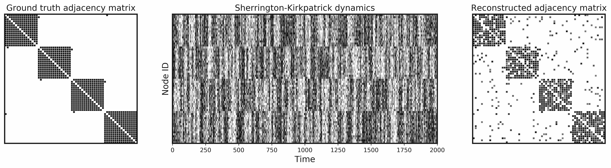
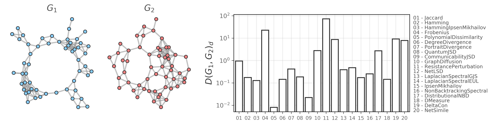
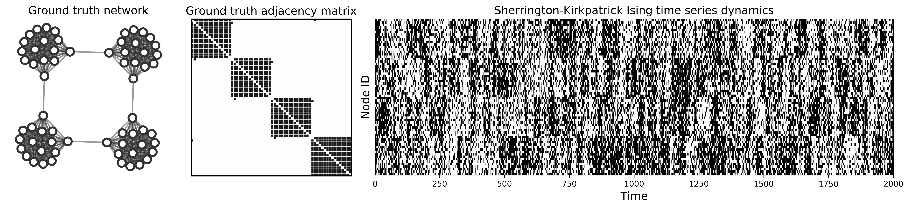

[](https://doi.org/10.21105/joss.02990)
[](https://badge.fury.io/py/netrd)
[](
    https://netrd.readthedocs.io)


# netrd: A library for network {reconstruction, distances, dynamics}

This library provides a consistent, NetworkX-based interface to various
utilities for graph distances, graph reconstruction from time series data, and
simulated dynamics on networks. 

Some resources that maybe of interest:

* A [tutorial](https://netrd.readthedocs.io/en/latest/tutorial.html) on how to use the library
* The API [reference](https://netrd.readthedocs.io/en/latest/) 
* A [notebook](https://nbviewer.jupyter.org/github/netsiphd/netrd/blob/master/notebooks/example.ipynb) showing advanced usage

# Installation

`netrd` is easy to install through pip:

```
pip install netrd
```

If you are thinking about contributing to `netrd`, you can install a
development version by executing

```
git clone https://github.com/netsiphd/netrd
cd netrd
pip install .
```

# Usage

## Reconstructing a graph

<p align="center">

</p>

The basic usage of a graph reconstruction algorithm is as follows:

```python
from netrd.reconstruction import CorrelationMatrix
import numpy as np
# 100 nodes, 1000 observations
TS = np.random.random((100, 1000))

reconstructor = CorrelationMatrix()
G = reconstructor.fit(TS, threshold_type='degree', avg_k=15)
# or alternately, G = reconstructor.results['graph']
```

Here, `TS` is an N x L numpy array consisting of L
observations for each of N sensors. This constrains the graphs
to have integer-valued nodes.

The `results` dict object, in addition to containing the graph
object, may also contain objects created as a side effect of
reconstructing the network, which may be useful for debugging or
considering goodness of fit. What is returned will vary between
reconstruction algorithms.

Many reconstruction algorithms create a dense matrix of weights and
use additional parameters to describe how to create a sparse graph; the
[tutorial](https://netrd.readthedocs.io/en/latest/tutorial.html) has more
details on these parameters.


## Distances between graphs

<p align="center">

</p>

The basic usage of a distance algorithm is as follows:

```python
from netrd.distance import QuantumJSD
import networkx as nx
G1 = nx.fast_gnp_random_graph(1000, .1)
G2 = nx.fast_gnp_random_graph(1000, .1)

dist_obj = QuantumJSD()
distance = dist_obj.dist(G1, G2)
# or alternatively: distance = dist_obj.results['dist']
```

Here, `G1` and `G2` are `nx.Graph` objects (or subclasses such as
`nx.DiGraph`). The results dictionary holds the distance value, as
well as any other values that were computed as a side effect.

## Dynamics on graphs

<p align="center">

</p>

The basic usage of a dynamics algorithm is as follows:

```python
from netrd.dynamics import VoterModel
import networkx as nx
ground_truth = nx.karate_club_graph()

dynamics_model = VoterModel()
synthetic_TS = dynamics_model.simulate(ground_truth, 1000)
# this is the same structure as the input data to a reconstructor
# G = CorrelationMatrix().fit(synthetic_TS)
```

This produces a numpy array of time series data.


# Contributing

Contributing guidelines can be found in [CONTRIBUTING.md](CONTRIBUTING.md).


# Publications

* McCabe, S., Torres, L., LaRock, T., Haque, S. A., Yang, C.-H., Hartle, H., and
Klein, B. (2021). netrd: A library for network reconstruction and graph
distances. *Journal of Open Source Software* 6(62): 2990.
doi:&nbsp;[10.21105/joss.02990](https://doi.org/10.21105/joss.02990).
arXiv:&nbsp;[2010.16019](https://arxiv.org/abs/2010.16019).
    + paper detailing the methods used in this package

* Hartle H., Klein B., McCabe S., Daniels A., St-Onge G., Murphy C., and
Hébert-Dufresne L. (2020). Network comparison and the within-ensemble graph
distance. *Proceedings of the Royal Society A* 476: 20190744.
doi:&nbsp;[10.1098/rspa.2019.0744](http://doi.org/10.1098/rspa.2019.0744).
arXiv:&nbsp;[2008.02415](https://arxiv.org/abs/2008.02415).
    + recent work introducing a baseline measure for comparing graph distances
